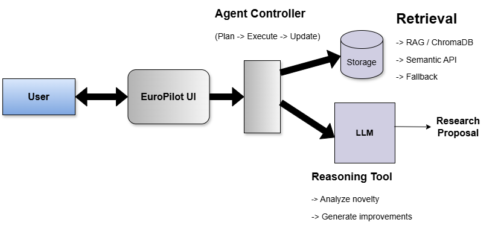
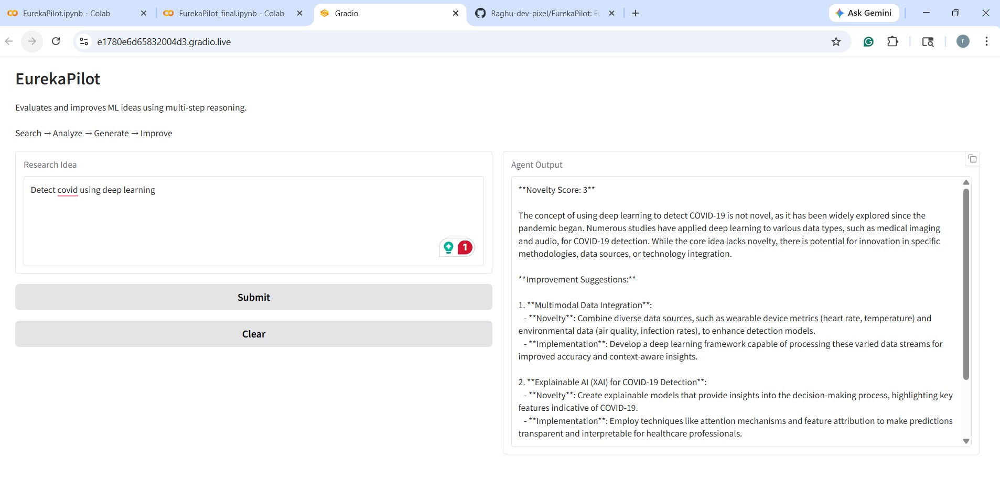
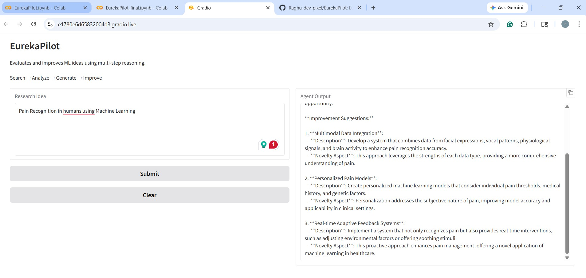

# EurekaPilot
**EurekaPilot** is an AgenticAI that evaluates the novelty of research ideas and suggests actionable improvements through structured reasoning and tool integration.

## Overview
EurekaPilot takes a vague research idea and:
* Breaks into simple, structured tasks
* Retrieves relevant research papers either from the RAG or through the Semantic Scholar, depending on the availability
* Determines novelty
* Suggests concrete improvements

## Core Workflow
Goal (Idea) -> Plan -> Search -> Analyze -> Generate -> Final unique Research Proposal

## Benefits of EurekaPilot
* **Eureka** -> Discover new research proposals that could be useful for students, especially during the time of their thesis.
* **Pilot** -> Guides the direction
There are several AI applications in the market, but most of them help users with summarizing documents, novelty checking, and LLM-based chatbots.
On the contrary, **EurekaPilot** acts as a research companion, helping students with:
* Understanding existing work
* Assess novelty and uniqueness
* Refine vague and basic ideas into stronger research proposals

## Agent Architecture
EurekaPilot uses a deterministic execution loop and performs the following tasks:
1) **Plan** -> Convert the user's idea/goal into a structured TODO list
2) **Search** -> The agent searches for research papers based on semantics, first in the RAG and then through Semantic Scholar if the papers are not available in the local RAG
3) **Analyze** -> Evaluate novelty using retrieved context
4) **Generate** -> Suggests actionable improvements
5) **Finalize** -> Combine essential results into unique research proposals

## Tools Used
1) **Semantic Scholar API** -> Academic search engine. (papers from arXiv, journals, etc)
2) **ChromaDB/RAG** -> Stores or retrieves previously saved papers
3) **OpenAI API** -> Used for planning, analysis, and generation
4) **Gradio** -> Provides a minimal UI for the application.

## Retrieval Strategy
EurekaPilot uses a multi-layer retrieval pipeline:

ChromaDB (local memory) 
    | (If not found)
Semantic Scholar API
    |  (If failure)
LLM fallback

This retrieval strategy ensures the following key features are provided:
* **Relevance filtering**: Prevents incorrect reuse of cached results
* **Fallback handling**: Ensures the system never fails
* **Caching**: Improves efficiency across runs

## Context Strategy
To avoid prompt overflow and maintain quality:
* **Kept**
* User goal/idea
* Retrieved papers (title + short abstracts)
* Analysis output
* **Dropped**
* Full conversation history
* Raw tool responses beyond relevance

## Design Trade-offs
* **Deterministic loop vs autonomous agents** -> Easier debugging and control
* **Relevance filtering vs complex ranking** -> Avoids over-engineering
* **RAG vs Full conversation memory** -> Prevents context bloat
* **Single domain focus** -> Improves depth and quality

## How to Execute EurekaPilot
* Download EurekaPilot.py from this repo into your local system
* Ensure your system (Laptop/ desktop) has Python installed (python --version) in it
* Install the following Python libraries
  ```bash
  pip install openai
  pip install gradio
  pip install chromadb
  ```
* Run the tool, using the command below
  ```bash
  ./EurekaPilot.py
  ```
* An alternative way is to upload the EurekaPilot.py to Google Colab and run the application from Google Colab
  
## Demo
EurekaPilot includes a minimal UI designed using gradio:
* **Input**: Research Idea
* **Output**: Novelty score + analysis + Research proposal
* **Logs**: Available on the terminal but not on the gradio, this provides transparent execution steps
* **Sample Examples**: , 

## Note 
1) When running locally -> ChromaDB persists data
2) In Google Colab -> acts as a session memory unless backed by Google Drive

## Future Improvements
* Provide Multi-Agent support
* Add source contribution
* Improve query generation
* Enhance retrieval relevance filtering
* Explore GraphRAG-based data handling for context-based retrieval

## Time and Trade-off
* Avoided use of frameworks such as LangChain, AutoGen, and so on
* Focused on core functionality and robustness
* Prioritized in keeping the design simple and clear
* Implemented custom loop, prompts, and context handling.
* Made use of all the tools provided in the core as well as the optional section (RAG, external tools, UI, and provided memory-based persistence)


  
